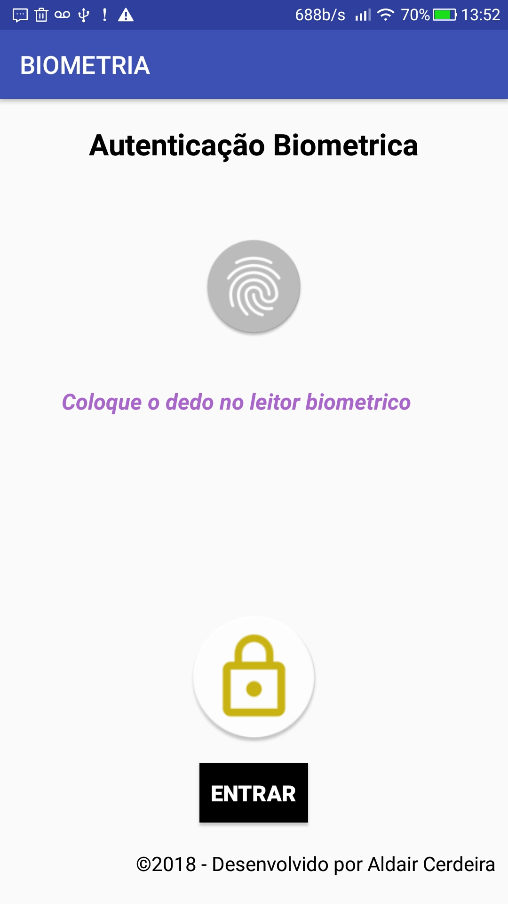
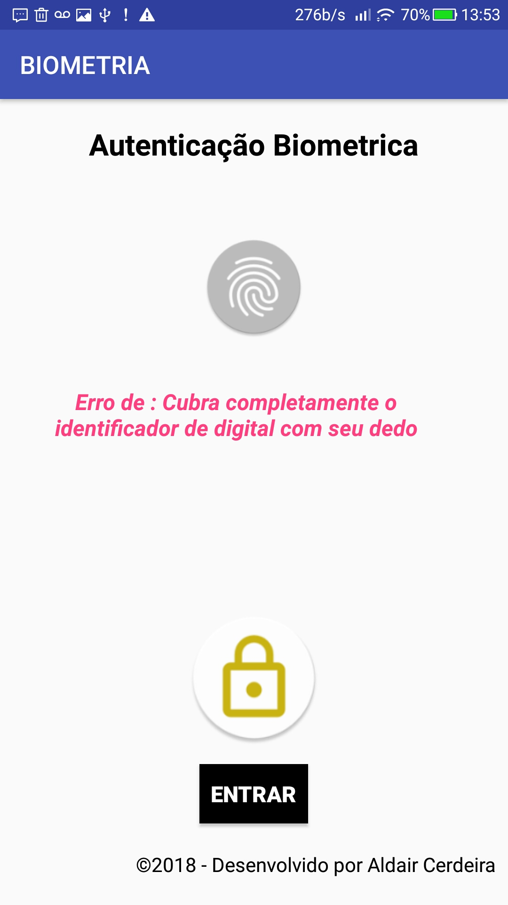

# SISTEMA DE IDENTIFICAÇÃO E AUTENTICAÇÃO BIOMÉTRICA

- 	Curso:  Ciência da computação	
-   5ª período | 2ª semestres de 2018
- 	Trabalho de atividades pratica supervisionadas – APS

## Informações do app
- Linguagem de programação: Java 8

- IDE de desenvolvimento: Android Studio

- sistema: aplicativo para Android

- Versão do Android – o projeto foi desenvolvido para ser rodado a partir da versão 6  marshmallow 

## Apresentação do aplicativo

